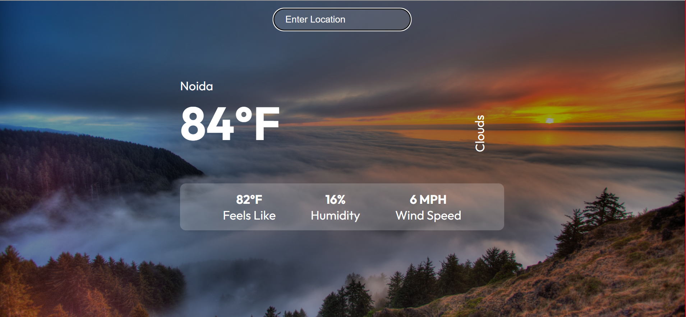

# Getting started with project
This project is completely bootstrapped and made with the help of:
- React
- Open Weather API

### Setup Weather app on localhost
Here are the following steps:

1) npm i or npm install
2) npm start

### Project is hosted on Vercel
Vercel is a cloud platform for static sites and serverless functions. 

### A glimpse of what I have created -

### Live Link 